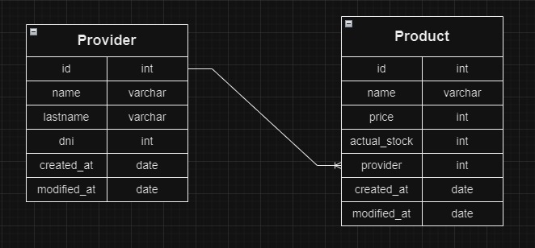
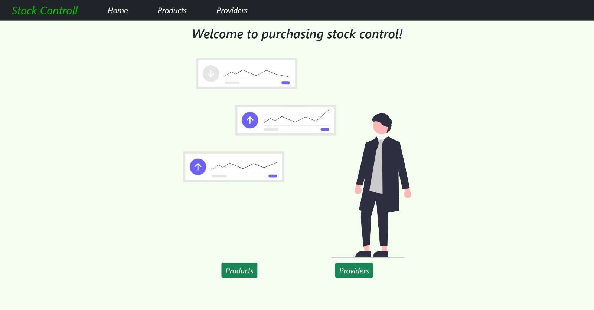
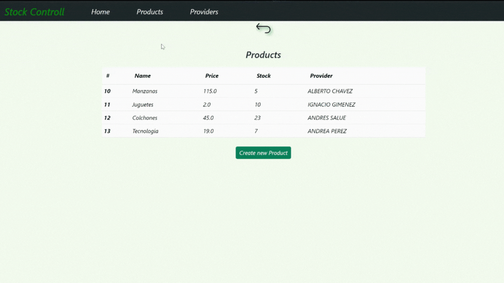
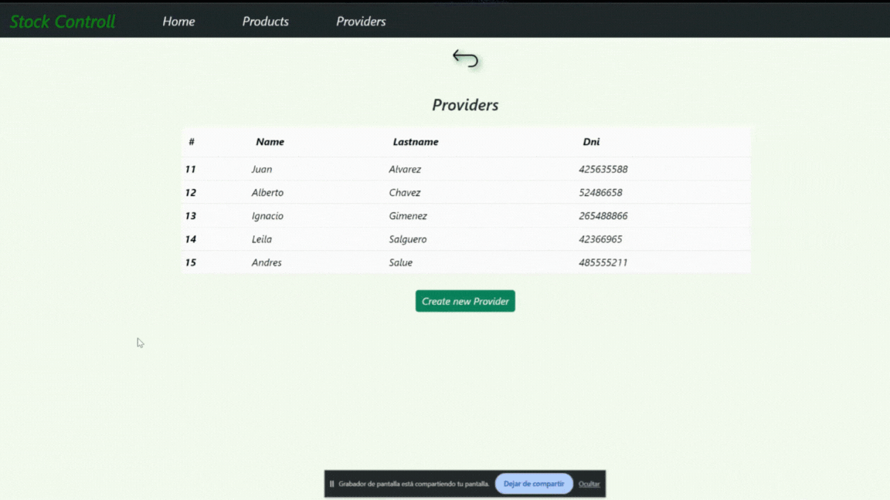

# 📊 Stock Controll 📈
Stock control is a purchasing stock organizer based on products and providers.

## 📌 About this proyect

This project is a server-side aplication
- __Back End__: Python, Django
- __Database__: SQLite

This project implements a architecture `MODEL - VIEW - TEMPLATE`.

### 📌 How to start this page ?

📍 You can run:

- In stock-controll folder execute the command:
    - `venv/Scripts/activate.bat` for activate the environment
    
- In src folder execute the command:
    - `python manage.py runserver` to initialize the server.

When the project is initialized, you can view it at
Open [http://localhost:8000/buys/](http://localhost:8000/buys/) to view it in your browser.

## 📌 Stock Controll DER

 
    

## 📌 Sections of this project

### ⚡️Home:
- A little welcome to the app.

 
    

### ⚡️Products:
- You can see all the products created in the database. If you press "Create new product", you will be redirected to the form to create a new product.
  - Views used on this section: 
    - [Products](http://localhost:8000/buys/products) -> View all products 
    - [Create Product](http://localhost:8000/buys/products/new) -> Form for create a new product

 
    

### ⚡️Products:
- You can see all the providers created in the database. If you press "Create new provider", you will be redirected to the form to create a new provider.
  - Views used on this section: 
    - [Providers](http://localhost:8000/buys/providers) -> View all providers 
    - [Create Providers](http://localhost:8000/buys/providers/new) -> Form for create a new provider

 
    

